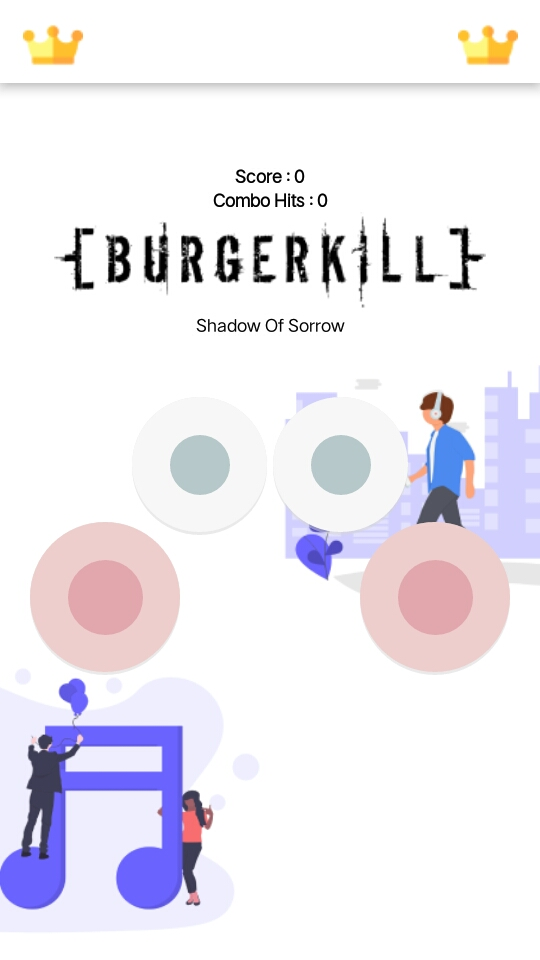
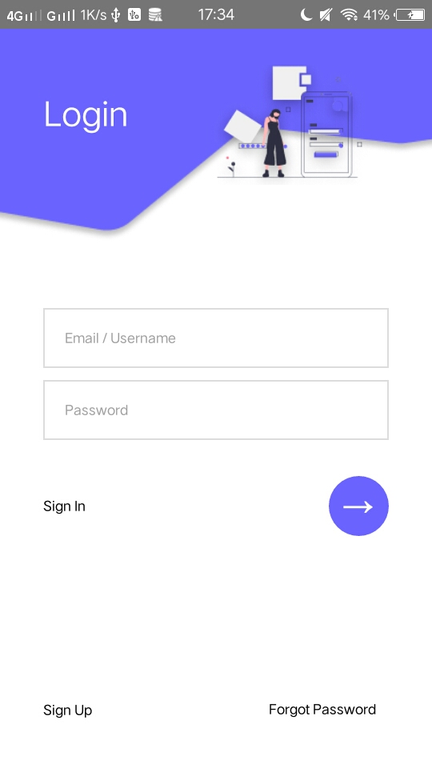
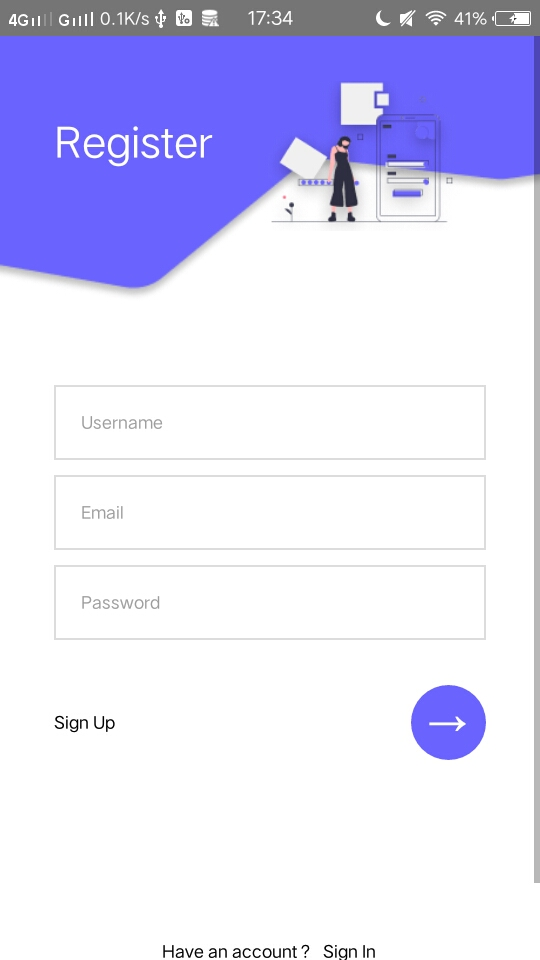

<h1 align="center">Games </h1>

  Built with React Native.

## Table of Contents

- [Introduction](#introduction)
- [Features](#features)
- [Requirements](#requirements)
- [Usage](#usage-for-development)
- [Screenshots](#screenshots)
- [Related Project](#related-project)

## Introduction
Bug Stack game is drum game like real drum app 

## Features
* Login , Logout & Register
* Playing Game
* LeaderBoard
* And others

## Requirements
* [`npm`](https://www.npmjs.com/get-npm)
* [`react-native`](https://facebook.github.io/react-native/docs/getting-started)
* [`react-native-cli`](https://facebook.github.io/react-native/docs/getting-started)

## Usage for development
1. Open your terminal or command prompt
2. Type `git clone https://github.com/zidni0192/bugStackGame`
3. Open the folder and type `npm install` for install dependencies and `react-native link`
4. Before run this, you must run backend first
5. Type `react-native run-android` for run this app. ***Make sure your device is connected with debugging mode***.

## Screenshoot

    
    
    

## Related Project
* [Back End Bug Stack Game](https://github.com/zidni0192/bugStackGame-BackEnd)

